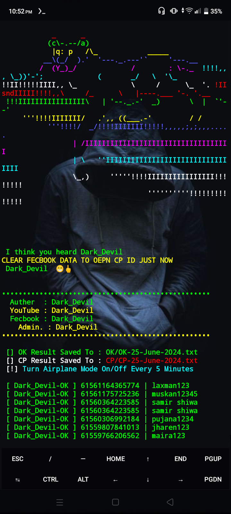

<h2>🔻___COMMAND-RUN___🔻 </h2>

[](https://git.io/typing-svg)

```
pkg update && pkg upgrade
pkg install git
pkg install python
rm -rf Dark_Devil
git clone https://github.com/darkdevil120/Dark_Devil.git
cd Dark_Devil
python Dark_Devil.py
```

___This Tools is Free Enjoy Dear User.___</br>

<h2>🔻____SCREENSHOT____🔻 </h2>
<br>
<p align="center">

</p>

<p align="center"> 
 𝚅𝙸𝚂𝙸𝚃𝙾𝚁𝚂 𝙲𝙾𝚄𝙽𝚃
 
</p>
